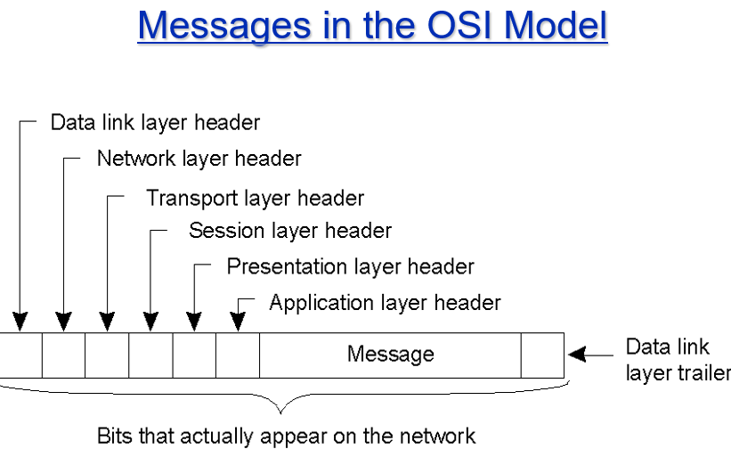

/assets/1598280615509.png)

**Physical Layer**: bits

**Data Link Layer**: frames

**Network Layer**: packets routing(**IP**)

**Transport Layer**: Actual communication, **TCP/UDP**

Session, Presentation, Application Layer

**Modular Design Principle** and **Software Engineering Principle(Reuse)** 